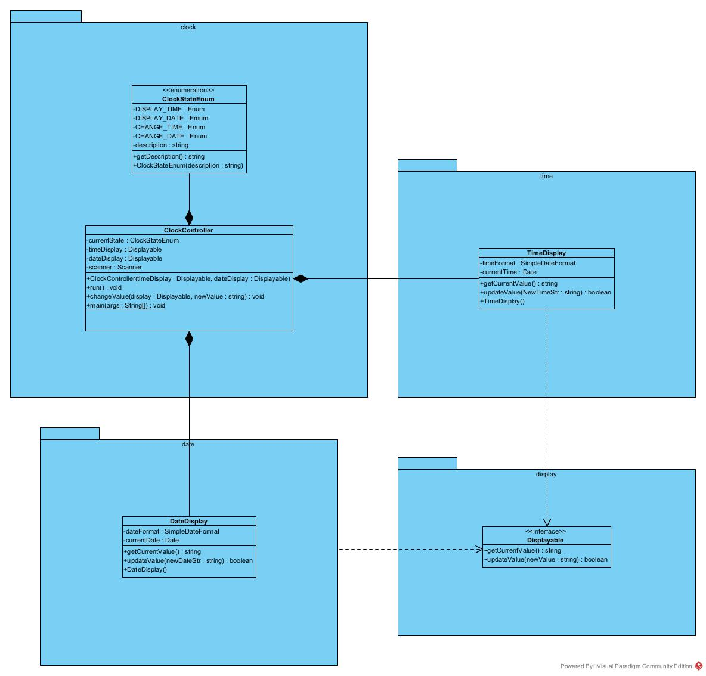

"# avancerad-java-mp1-Markus-Johansson" 

Beskrivning

Jag har valt att separera tid- och datumhantering i egna klasser för att följa principen om enkelt ansvar och göra koden mer modulär och lätt att underhålla. Dessutom har jag inkluderat felhantering för att hantera ogiltiga inmatningar och göra programmet robust och användarvänligt. Denna design är också tillståndsdriven med hjälp av ClockStateEnum, vilket gör det enkelt att organisera och förstå programflödet. Slutresultatet är en applikation som kan visa och ändra tid och datum på ett smidigt sätt och som kan utökas med ytterligare funktioner om så önskas.

